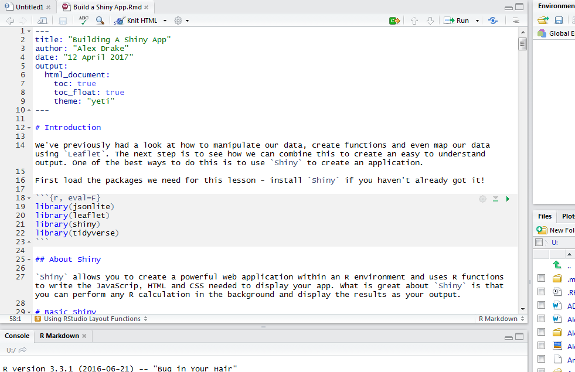
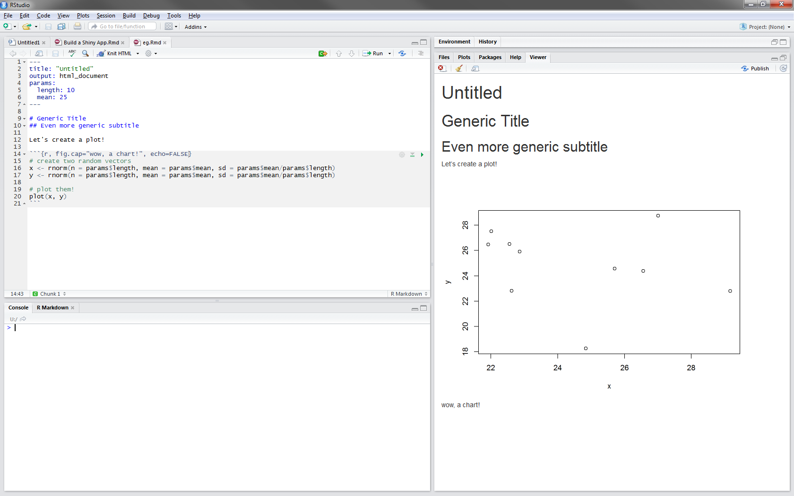

# Introduction

We've seen how to process and visualise our data using various means, and hopefully we should have seen how to produce an application using `R Shiny`. However, sometimes presenting your data in an app can be overkill - what about business as usual reports and presentations? Well luck would have it that R can also deal with this for you using `R Markdown`!

`R Markdown` can be used to save and exectue code, and generate high quality reports for sharing with others. These documents are fully reproducible and can be created in a number of static or dynamic output formats. In fact, this very document was written and rendered using `R Markdown`.

You may find the following links useful:

* [The R Markdown Cheatsheet](https://www.rstudio.com/wp-content/uploads/2016/03/rmarkdown-cheatsheet-2.0.pdf)
* [The R Mardown Reference Guide](https://www.rstudio.com/wp-content/uploads/2015/03/rmarkdown-reference.pdf)

# About R Markdown

An `R Markdown` file is shown below. It is a plain text file that has the extension `.Rmd` and contains three types of content; a header surrounded by`---`, 'chunks' of R code surrounded by ```, and text in simple text formatting.



We then create the output file by clicking the "Knit" button or calling `rmarkdown::render()` - note that we can change the output to web page (HTML), PDF, MS Word, slide show and other formats.

First we need to look at how to insert code into the document using chunks.

# Code in R Markdown
## Code Chunks

Code chunks can be inserted into your markdown document by various means and will run each time you knit/render your file

* typing the chunk delimiters \```{r} and \```
* clicking the Add Chunk command in the editor toolbar
* using the keyboard shortcut **Ctrl + Alt + I**

Each chunk output can be customised to change the output display using the following arguments:

* `include = FALSE` prevents code and results from appearing in the finished file - this can be used for running code in the background or importing setup files and functions.
* `echo = FALSE` prevents code from appearing but not the results - this is usually used for embedding images/maps/tables.
* `message = FALSE` prevents messages that are generated by the code from appearing in the finished file (such as import information for your data/shapefiles).
* `warning = FALSE` prevents warnings that are generated by the code from appearing in the finished file.
* `fig.cap = "..."` adds the specified caption to a graphical result.

Note that you could include charts, tables and even maps in your chunks and R Markdown should display them in your document. 

## Inline Code

You can also insert inline code directly into your text by enclosing the code with \``r `\`. This is particularly useful when embedding results into a sentence, as shown below.

```{r, echo=TRUE}
# This is a chunk
x <- paste0("The pressure is ",pressure$pressure[pressure$temperature == 200], " when the temperature is 200.")
print(x)
```

...and here we'll run it inline...
The pressure is `r pressure$pressure[pressure$temperature == 200]` when the temperature is 200.

See that running the code inline means we retain the formatting.

# Parameters

R Markdown documents can take in several input parameters that are declared when you render the report. This can be really useful if you only want to change one or two aspects (date ranges for example) but want to limit the possibility for errors to creep in. A really rough example is shown in the image below, where we've used `rnorm()` to generate two vectors with length 10 and mean 25. We then use `plot()` to show the output. Note that we access parameters like we would elements of a list or data frame using `params$<parameter name>`.



# Formatting

You can format your code with a few different sets of annotations

* `*italics*` *italics*
* `**bold**` **bold**
* \`code\` `code`
* `[links](genericlink.com)` [links](genericlink.com)

We can also use similar formatting to make equations 

* Latex Equations `$E = mc^{2}$` $E = mc^{2}$

Other possibilities are

* Headers
* Lists
* Links
* Images
* etc.

# Exercise

You've seen the basics for R Markdown so now you'll need to check your understanding by ~~jumping through the following hoops~~ creating an HTML document! Make sure you knit/render your document at each step, just to check that you've got it correct.

1. Open R and create a blank Markdown file - give it an appropriate title and add in your name.
2. Create a line of text that says "Today's date is " and then add inline code to display todays date.
    + Change the format of the date so it reads like 'DD-MON-YY' eg '03-May-17'.
3. Create a summary table for the R data set `iris`. Note that there are several ways to do this (check the help links!!) but try to make something that looks good - I like using `knitr::kable` but you can also use `DT` for more interactive tables.
4. Continuing to use the `iris` data set, create sentences that state the mean sepal length, median sepal width, maximum petal length and minimum petal width. Also create a summary sentence stating how many plants were measured (**hint:** how many rows are in the data set??). Make sure that these are formatted as bullet points!
5. Use `ggplot2` to create a scatter plot of **Sepal Length** vs **Sepal Width**.
    + Group and colour the points by species
    + Create a figure caption and label it "I HEART PLANTS 4EVA"
6. Add a link to the *Iris setosa* wikipedia page (https://en.wikipedia.org/wiki/Iris_setosa)
    + Include the image shown on the wiki page in your document (save it to your working directory otherwise the document might not knit)
  
You've reached the end of today's course, well done!

> Insert motivational quote here