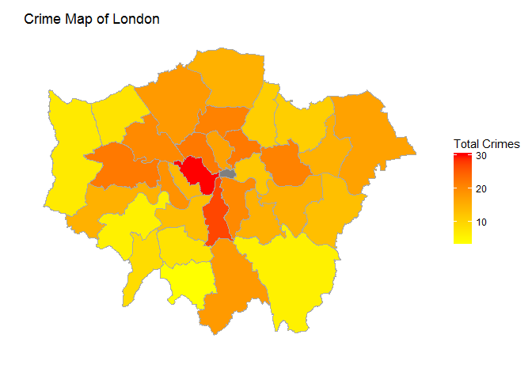
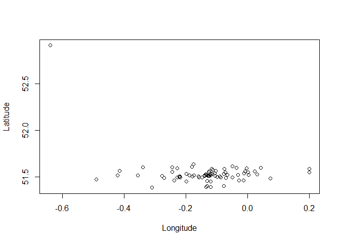
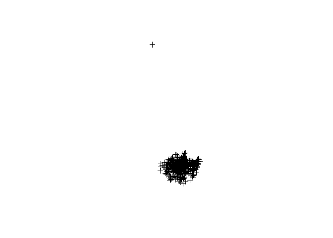
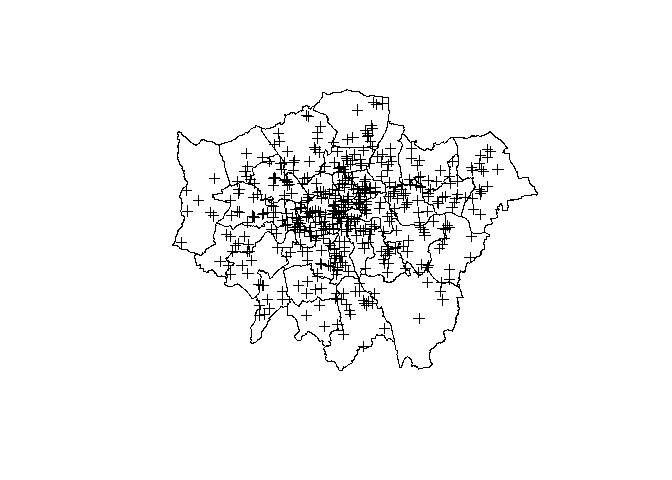
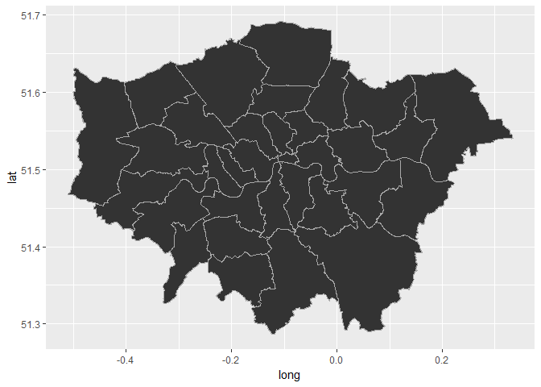
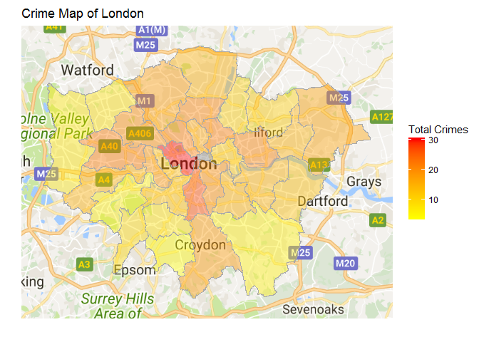

# Using R for Mapping
CPOS ATT  
31 May 2018  


# Introduction

R is a powerful tool when it comes to producing visualisations for your data in graphical form. How about when you want to visualise your data spatially? Well luckily the 'grammar for graphics' from `ggplot2` can be used to map your data as well as producing beautiful charts (**note** beauty not guaranteed). 

We're going to look at creating a map using your data and then a few methods to display this; firstly as points and then by aggregating points to polygons. You can follow this course through be copying the sections of code into your RStudio script (top left hand box in RStudio). Note that we're going to name our variables/data sets so that we know what they are here, eg `boro = boroughs`, but you should think about changes these if you were to use your own data eg change `boro` to `hex` if you are using hexagons as a shapefile.

First things first, let's set up a working directory on our T: drive as this is where we'll be getting our data from shortly. We'll also need to make sure we have the correct packages installed (if you haven't done so already). Delete the hash ('**#**') before `install.packages()` in the code below if you need to install the packages.


```r
setwd("T:/IAT and Taskings/Research Library/Data Science/General/R/Internal R Training/Using R for Mapping/")

# install these packages!!
packages <- c("tidyverse",
              "rgdal",
              "rgeos",
              "leaflet")
# install.packages(packages, dependencies = TRUE)

# load packages
library(tidyverse)
library(rgdal)
library(rgeos)
```

Here's the code that we're going to use today, we'll break it down later.


```r
## Import Data ----
df <- read.csv(file = "data/mps crimes.csv", header = TRUE, na.strings = c("","NA"))
df <- df %>% filter(!is.na(Longitude) & !is.na(Latitude))
df$ID <- 1:nrow(df)

## Convert to spatial data ----
coords <- cbind(Longitude = as.numeric(as.character(df$Longitude)), Latitude = as.numeric(as.character(df$Latitude)))
df.sp <- SpatialPointsDataFrame(coords = coords, data = df, proj4string = CRS("+init=epsg:4326"))

## Import Borough layer ----
boro <- readOGR(dsn = "gis/Boroughs_region.shp", layer = "Boroughs_region", verbose = FALSE)
boro <- spTransform(boro, CRS("+init=epsg:4326"))

## Spatial Query ----
df.sp@data <- cbind(df.sp@data, df.sp %over% boro)

## Aggregate data to Borough level (shape/segment etc) ----
df.agg <- df.sp@data %>% 
  filter(!is.na(BOROUGH)) %>%
  group_by(BOROUGH) %>%
  summarise(TotalCrimes = length(Crime.type))

## Convert so we can map it ----
gg.boro <- broom::tidy(boro, region = "BOROUGH") %>%
  left_join(., df.agg, by = c("id" = "BOROUGH"))

## Map it! ----
map <- ggplot(data = gg.boro, aes(x = long, y = lat, group = group)) +
  geom_polygon(color = "dark grey", size = 0.3, aes(x = long, y = lat, group = group, fill = gg.boro$TotalCrimes)) +
  labs(title = "Crime Map of London", x = "", y = "") + 
  theme(axis.text = element_blank(),
        panel.background = element_blank(),
        panel.grid = element_blank(),
        axis.ticks = element_blank()) +
  coord_map("polyconic") +
  scale_fill_gradient(low = "Yellow", high = "Red", name = "Total Crimes")

map
```

<!-- -->

# Plotting Point Data

First, let's read in our data using `read.csv()`. We must let the function know where our file is by feeding the path in as `file = 'superSecretFunFile.csv()`, state that our file contains column titles/headers by stating `header = TRUE` and to expect `NA` or blank values using `na.strings = c("","NA")`. If you wanted to change the data to something else, then you'll need to change the `file = ...` section. You may also want to change the earlier `setwd()` function to whatever your project folder is (eg "T:/IAT and Taskings/Analysis/Congestion/TrafficJams/Are/Annoying/")

We're going to use a sample of Metropolitan Police data from [https://data.police.uk](https://data.police.uk), this is an open data source detailing crime and policing in England, Wales and Northern Ireland. Note that we could have used their API to pull the data directly into R but let's not get ahead of ourselves!

Once imported, have a quick look at the data using `View()`.


```r
df <- read.csv(file = "data/mps crimes.csv",
               header = TRUE,
               na.strings = c("","NA"))

View(df)
```

You should see a data frame with 500 rows and 11 columns, some of which aren't particularly useful but that's OK...

We can see what categories exist within our data by looking at the Crime Type column, and use the `unique()` function. You don't **HAVE** to do this but it helps you get to grips with what your data looks like.


```r
crimes <- unique(df$Crime.type)
```

We can use the R base package to quickly plot the points into a chart - this isn't particularly useful but is a quick and dirty way to look at your data. We call it as we would a regular plot although we specify the Longitude and Latitdes as the X and Y coordinates.

Plot the crimes defined as 'Other theft' - you should see the plot below! If you don't see any points on your plot then check what class the data is stored as. We can select these particular crimes by using the `filter()` function and the `%in%` operator. This basically translates as we want to create another dataframe from `df` by filtering out all records where the *Crime.type* is 'Other theft'. Get it? Don't worry, we'll practice it a few more times!


```r
#other <- df[df$Crime.type=="Other theft",]
other <- df %>% filter(Crime.type %in% "Other theft")

# set as numeric so R knows Long/Lat is a number!
plot(x = as.numeric(other$Longitude), y = as.numeric(other$Latitude),
     xlab = "Longitude", ylab = "Latitude")
```

<!-- -->

We now want to translate the flat *csv* data into something we can plot on a map. If we did this in MapInfo then we would use `Create Points` and faff around with that, in R we need to use `SpatialPointsDataFrame`. We'll want to clean the data first by removing the rows that do not have coordinates as these will stop the conversion from happening. Again, we're using the `filter()` function but this time selecting all data where *Longitude* IS NOT 'NA' (or blank) AND where *Latitude* IS NOT 'NA'. You'll notice we've used the `is.na()` function and then put **'!'** in front of it - this means NOT, so putting it together we get NOT IS NA, or IS NOT NA in english...

Once done, you'll notice that we have lost 8 rows of data.


```r
df <- df %>%
  filter(!is.na(Longitude) & !is.na(Latitude))
```

Now we need to create a unique ID for each crime as `SpatialPointsDataFrame` must have a unique ID for each entry/row.


```r
df$ID <- 1:nrow(df)
```

We can now load in the package `rgdal` so we can call the `SpatialPointsDataFrame` function. 

We need to tell it where our coordinates are, which we do by creating a set of coordinates called `coords` using `cbind()` and feeding in the applicable columns from our data (here we use Longitdue and Latitude).

We also need to tell R what our projection is ie what format the coordinates are in. For this session we are using latlong so need to pass in the value `"+init=epsg:4326"` - you could use easting/northing instead so we'd just change the value in `CRS()` to `"+init=epsg:27700"`. We won't need that here though!


```r
# define the coordinates
coords <- cbind(Longitude = as.numeric(as.character(df$Longitude)), 
                Latitude = as.numeric(as.character(df$Latitude)))

# create the SpatialPointsDataFrame
df.sp <- SpatialPointsDataFrame(coords = coords,
                                data = df,
                                proj4string = CRS("+init=epsg:4326"))
```

Now plot the points to see how our data differs from before. Hmm, looks like we have a straggler. Perhaps we could query the data so we *only* look at crimes within London.


```r
plot(df.sp)
```

<!-- -->

Note that you can also interrogate your data as normal using the `View` function although you must add an extra element so R knows which part of your spatial data frame to look at. You can do this by calling `View(df.sp@data)`.

# Spatial Queries in R

We've imported a csv file and created some points from the coordinates. Now we want to import a shapefile so that we can query the data and find out which crimes have occurred in which Borough (yes I know that TECHNICALLY it's already in the data set but it could be wrong...shock horror).

Let's start by loading in our shapefile, again using `rgdal`. We'll need to read in the shapefile and then convert it so it is in the same coordinate system as our data points. Note that here we must define where our shapefile is using `dsn = blah` and which layer we're interested in using `layer = blah` - these are usually the same, although you can drop '.shp' from `layer` and lose `layer` altogether if importing a '.tab' file. This is the second key change if we were to use our own data (this could be ODT segments, London Wards, Hexagons etc). 

We also define `verbose=FALSE` as this supresses any messages as the file loads.


```r
# Read in the shapefile
boro <- readOGR(dsn = "gis/Boroughs_region.shp",
                layer = "Boroughs_region",
                verbose = FALSE)

# convert to lat-long
boro <- spTransform(boro, CRS("+init=epsg:4326"))
```

Quickly check to make sure that your data is in the same coordinate system. You can do this by calling plot twice, the second time making sure to select `add=TRUE` so R knows we're adding it to a plot we've already made.


```r
# plot boroughs
plot(boro)

# add the data points
plot(df.sp, add = TRUE)
```

<!-- -->

Now let's query the data by getting R to select the points that sit within each borough. We can do this by using the function `%over%` combined with `cbind()` to basically query and join the data, which is similar to the `IN` call in SQL/MapInfo. 


```r
df.sp@data <- cbind(df.sp@data, df.sp %over% boro)
```

# Aggregating Data to Your Polygons

So we've determined which crimes have occurred in which Boroughs and have displayed them on a map. However, this isn't particularly useful for presenting to others. Let's have a look at counting the total number of crimes per borough and then adding this as a value to our borough data frame.

We'll start by cleaning the crime data to crimes only in London and then aggregating to borough level using the `dplyr` package. This can be done by selecting the crimes where Borough is not NA using `filter()` (remember '**!**' means  'not'), and then summing the number of points in each borough using the `group_by()` and `summarise()` functions. 

We need to tell `group_by()` which data frame to look at and then which variable column we want to aggregate/sum on - for this we will use the Borough column! We also need to provide a name for the column where the summed data will be stored - here I've called it 'TotalCrimes'. Note that because the data we are counting is stored as a factor, we need to tell R to count the number of rows within each Borough by using the `length()` function. We could have done this using `mean()`, `sum()` etc. if we wanted to create summaries for numerical data.


```r
# Clean the data
df.agg <- df.sp@data %>%
  filter(!is.na(BOROUGH)) %>%
  group_by(BOROUGH) %>%
  summarise(TotalCrimes = length(Crime.type))

# Check the data
head(df.agg)
```

```
## # A tibble: 6 x 2
##                BOROUGH TotalCrimes
##                 <fctr>       <int>
## 1 Barking and Dagenham          15
## 2               Barnet          18
## 3               Bexley          13
## 4                Brent          20
## 5              Bromley           6
## 6               Camden          22
```

We now need to `tidy` our data so we can create a map (note this works a little differently/is more simple if we use `leaflet` but we won't cover that in this session, and it has it's own issues when it comes to sharing the output with others).

Once we've used `tidy` we can join the data onto the shapefile using the column "id" (created in the `tidy` function) and "BOROUGH" from the aggregated data. This stage may be unfamiliar as it isn't required in MapInfo but is something we must do to create static maps in R - otherwise it's a similar process!


```r
gg.boro <- broom::tidy(boro, region = "BOROUGH")
gg.boro <- left_join(gg.boro, df.agg, by = c("id" = "BOROUGH"))

ggplot(data = gg.boro, aes(x = long, y = lat, group = group)) + 
  geom_polygon(color = "dark grey", size = 0.3)
```

<!-- -->

We're now going to look at how we can change the appearance of our map by using the functions in `ggplot2`. This is equivalent to creating a map theme in MapIno and may be a bit confusing to start with but if you spend time looking at how to build up a `ggplot2` chart then you'll be fine. 

Don't worry if you're not interested in that bit, we'll just cover the key steps here!

* Let R know what data our theme is based on using `fill = gg.boro$TotalCrimes`
* Add a title to the chart using `labs(title="blah")`
* Remove x and y labels using `x=""` and `y=""`
* Remove any grids, axis text and axis markers using `theme()` and `element_blank()`
* Add a projection to the map (so it looks like it does IRL) using `coord_map("polyconic")`
* Define the colours for our thematic map using `scale_fill_gradient()`

You can change the colour scheme using `scale_fill_gradient()` and add a legend title that looks a little bit nicer. Note that if we had discrete data, we could instead use `scale_fill_brewer()` - check the help file to find out more by typing `?scale_fill_brewer` into the console.


```r
map <- ggplot(data = gg.boro, aes(x = long, y = lat, group = group)) +
  geom_polygon(color = "dark grey", size = 0.3, 
               aes(x = long, y = lat, group = group, 
                   fill = gg.boro$TotalCrimes)) +
  labs(title = "Crime Map of London", x = "", y = "") + 
  theme(axis.text = element_blank(),
        panel.background = element_blank(),
        panel.grid = element_blank(),
        axis.ticks = element_blank()) +
  coord_map("polyconic") +
  scale_fill_gradient(low = "Yellow", 
                      high = "Red",
                      name = "Total Crimes")
map
```

<!-- -->

# Extension

If you want to take this further, you could also add in a basemap using another package that speaks the `ggplot2` language, whilst allowing you to include a basemap from Google, OpenStreetMap and some other suppliers. Here we'll quickly show you how to use `ggmap` so you can go full belt and braces. Note that you'll need to replace the first `ggplot()` call with `ggmap()` instead!

We'll need to define a bound box (area of interest) using `make_bbox()` and the borough shapefile limits. We can then `get_map()` and use this to create our final map. Set your limits to the shapefile you are using as otherwise you will get a very zoomed out map! You can do this using `xlim()` and `ylim()` but you'll want to expand the bounding box slightly to make sure you don't get any strange looking shapes (they may fold in on each other if there isn't enough room). Also remember to set an `alpha` within the `geom_polygon()` function as this will allow us to see the basemap underneath the map.


```r
library(ggmap)
bounding_box <- make_bbox(lon = boro@bbox[c(1,3)], lat = boro@bbox[c(2,4)], f=1)

mapArea <- get_map(location = bounding_box, maptype = "roadmap", source = "google")

gmap <- ggmap(mapArea) +
  geom_polygon(data = gg.boro, color = "dark grey", 
               size = 0.3, alpha = 0.4,
               aes(x = long, y = lat, group = group, fill = gg.boro$TotalCrimes)) +
  labs(title = "Crime Map of London", x = "", y = "") + 
  xlim(boro@bbox[c(1,3)] + c(-0.01,0.01)) +
  ylim(boro@bbox[c(2,4)] + c(-0.01,0.01)) +
  theme(axis.text = element_blank(),
        panel.background = element_blank(),
        panel.grid = element_blank(),
        axis.ticks = element_blank()) +
  coord_map("polyconic") +
  scale_fill_gradient(low = "Yellow", 
                      high = "Red",
                      name = "Total Crimes")
gmap
```

<!-- -->

You can also export your maps as an image file or pdf using `png()` and `dev.off()`, you'll just need to call your map variable between the two and hey-presto, hay-pesto.


```r
png(filename = "exampleOutput.png", width = 960, height = 751)
gmap
dev.off()
```

```
## png 
##   2
```

You do have other (and potentially more simple) options available for making a map (see [Leaflet](https://rstudio.github.io/leaflet/)) although you will run into issues on how to make that map available to others, hence the slightly more convoluted route to output png maps above! However, it's still useful to have a look at and learn how to do it as `Leaflet` is a really useful tool for sense checking your work quickly.

*C'est la fin*
